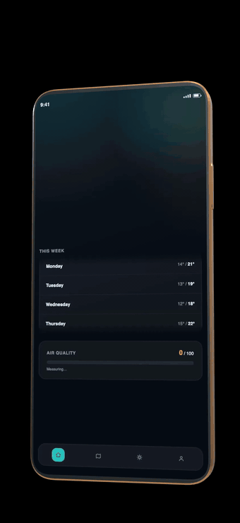

# Showcase

Turn a screen recording into a cinematic device-mockup video of your app playing on a floating 3D phone, or into an animated hero web page.



## What it does

Feed it a screen recording (or a single screenshot) and it produces one of two things:

- **An MP4 video.** Your recording, playing on a 3D phone, tablet, laptop, or browser window, shot like a product ad.
- **A self-contained animated HTML page.** One file, no server, no network calls. Drop it anywhere and it plays.

If you would rather compose the shot yourself instead of taking the defaults, there is also a visual editor (see below).

The camera work is automatic. It tilts the device into view, pushes in for close-ups on whatever is happening on screen, pulls back out, then snaps into an ending that fills the entire frame with your screen content. The snap takes about 0.6 seconds regardless of clip length, so it reads as a deliberate landing.

Devices are generic shapes on purpose: no notches, no logos, no Apple trade dress. The video is about your app, not the hardware.

## Quick start

Requirement: Node.js 20 or later.

The other dependencies install themselves. ffmpeg arrives with `npm install`, and the rendering browser downloads on your first render.

Clone the repository.

```sh
git clone https://github.com/tudorjuravlea/showcase.git
cd showcase
```

Install the dependencies.

```sh
npm install
```

Run the showcase command on a recording.

```sh
npm run showcase -- path/to/recording.mp4
```

Find the output path on stderr. The tool prints a line like `showcase: wrote <path>` when it finishes.

Note: the first render downloads Chromium (about 150 MB) once. Later renders reuse it.

## Use it as a Claude Code skill

The skill lives at `skills/showcase/` inside this repository.

Symlink it into your Claude Code skills folder.

```sh
ln -s "$(pwd)/skills/showcase" ~/.claude/skills/showcase
```

Open Claude Code in any project.

Say "showcase this `<file>`" and point it at your recording or screenshot.

## CLI flags

All flags are optional. Omit any of them and the CLI applies the default.

| Flag | Default | What it does |
|---|---|---|
| `--device` | `phone` | `phone`, `tablet`, `laptop`, or `browser`. |
| `--look` | `reference` | Camera choreography, see below. |
| `--duration` | full content length (clamped 6–120s; images: 10s) | Length in plain seconds, e.g. `--duration 10`. |
| `--fps` | `30` | Frame rate (5–60). |
| `--size` | `1080` | Short-side pixel size (240–2160); the other axis follows the device screen's aspect. |
| `--background` | black | Scene backdrop, `#hex` or a CSS color name. |
| `--frame` | `gold` | Device band finish: `gold`, `silver`, `graphite`, or `black`. |
| `--out` | auto-generated | Output file path. |
| `--html` | off | Export a self-contained animated HTML page instead of a video. |
| `--contained` | off | Keep the whole device in frame at all times, with no full-bleed close-up. Good for slides and fixed-size embeds. |

Looks: `reference` (the signature tilt, close-up, pull-back, and screen-filling snap ending), `auto-action` (finds and visits the on-screen action), `hero-drift`, `close-up-pan`, `orbit-loop`, `flat-lay-rise`, `hero-rise`. `--look auto` picks `auto-action` for video and `hero-drift` for images.

Full detail, including per-look descriptions and requirements, lives in [`skills/showcase/SKILL.md`](skills/showcase/SKILL.md).

## The editor

For designing a shot by hand there is a visual editor.

```sh
npm run dev
```

It opens at `localhost:5173`. Two renderers are available: a CSS 3D renderer for fast, interactive editing, and a WebGL renderer for photoreal output. Both export to the same places as the CLI, either a self-contained HTML page or rendered media.

## Tests

Run the unit test suite. It is fast and needs no external tools.

```sh
npm test
```

Run the end-to-end suite. It needs Chromium and an `ffmpeg` on your PATH, because the e2e specs shell out to `ffmpeg` directly, unlike the CLI. Run `npx playwright install chromium` once, and install ffmpeg with your package manager.

```sh
npm run e2e
```

## Contributing

Run `npm test` and `npm run lint` before opening a PR.

Run `npm run e2e` too if your change touches a renderer or the CLI.

Open an issue before starting any large or structural change.

Read [`docs/LESSONS.md`](docs/LESSONS.md) for how this is built and why, including the traps already found so you don't re-find them.

`docs/superpowers/` is a historical record of the build process, not a live guide.

## License

MIT, see [LICENSE](LICENSE).

Every HTML file this tool exports embeds a copy of three.js and carries its MIT notice. See [THIRD-PARTY-NOTICES.md](THIRD-PARTY-NOTICES.md) for the full list of bundled and external software.
